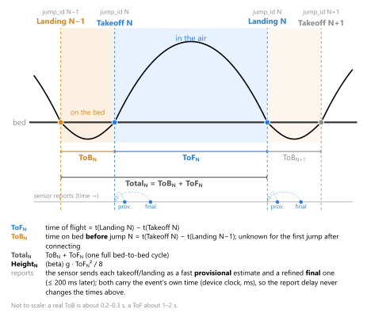

# OpenToF

**Open-source time-of-flight measurement for trampolining.** A small sensor clipped to the trampoline bed detects
every takeoff and landing, and a phone app shows how long each jump was in the air, runs timed routines and exports
the results.

## How it works

The sensor (a Seeed XIAO MG24 Sense with its built-in accelerometer and gyroscope) sits on the bed and feels each
bed contact: the sharp impact of a landing, the push-off and the free ringing after the takeoff. Its detection
algorithm reports every **takeoff** and **landing** over Bluetooth Low Energy with a timestamp. The app turns these
into the numbers athletes and coaches care about:

- **Time of flight (ToF)** — landing − takeoff of the same jump.
- **Time on bed (ToB)** — takeoff − the previous landing.
- **Total jump time** — ToB + ToF; **height** (beta) — g · ToF² / 8.

Each event is sent twice: a fast *provisional* estimate (so the app can beep and show the jump immediately) and a
refined *final* one shortly after, which replaces the first. Both carry the event's own time, so Bluetooth delays
never change the measured times.

## Features

- Live flight time of the last jump, a chart of recent jumps, optional time on bed and total jump time.
- Routines with a configurable number of jumps: start on the jump you just made, a beep per jump and a final sound,
  automatic stop after inactivity.
- CSV export of a routine or of the last 30 s / 1 min / 5 min of jumps.
- Missed and uncertain jumps are flagged; optional extra per-jump values from the detection algorithm
  (confidence, landing and push-off intensity, …).
- English and German, light and dark theme, Android 10+ and iOS 15+.
- Pluggable detection algorithms in the firmware; a demo mode sends simulated jumps for testing without a
  trampoline.

## Getting started

**Hardware:** a [Seeed XIAO MG24 Sense](https://www.seeedstudio.com/Seeed-XIAO-MG24-Sense-p-6248.html), a single-cell
LiPo, and the 3D-printed housing with trampoline clip from [`cad/`](cad/).

**Firmware** ([`firmware/`](firmware/)): open `firmware/OpenToF_Firmware/OpenToF_Firmware.ino` in the Arduino IDE with
the Silicon Labs board package (board "XIAO MG24 Sense", *Tools → Protocol stack → BLE (Arduino)*) and the "Seeed
Arduino LSM6DS3" library, then upload. The sketch header lists the exact setup; set `DEMO_MODE 1` in
`config/FirmwareConfig.h` to test the app without jumping.

**App** ([`app/`](app/)): with the Flutter SDK installed, `flutter run` from `app/`. In the app, open
*Settings → Scan for sensors* and pick your sensor. Debug builds also include a simulated sensor; see
[`app/README.md`](app/README.md).

App and firmware share their MAJOR.MINOR version (e.g. app 0.4.x works with firmware 0.4.x); the app warns if they
don't match.

## Repository layout

| Folder | Contents |
|---|---|
| [`app/`](app/) | Flutter companion app (Android + iOS) |
| [`firmware/`](firmware/) | Arduino sensor firmware (`OpenToF_Firmware/`) and helper/test sketches |
| [`cad/`](cad/) | Parametric FreeCAD housing with trampoline clip, printable STLs |
| [`software/`](software/) | Python tools for recording and plotting raw sensor data (`uv run <script>`) |
| [`img/`](img/) | Logo and wordmark sources (light and dark) |
| [`docs/`](docs/) | Decisions, plan, figures and hardware datasheets |

## Documentation

- [`Changelog.md`](Changelog.md) — what changed in each version.
- [`docs/DECISIONS.md`](docs/DECISIONS.md) — the resolved product and engineering decisions, including the BLE
  protocol in detail.
- [`docs/PLAN.md`](docs/PLAN.md) — architecture and milestone status.
- [`docs/hardware/`](docs/hardware/) — datasheets for the board, IMU and battery.

**Status:** early development. The app and firmware work end to end; detection algorithms are still being tuned on
recorded trampoline data, and the BLE UUIDs are placeholders until the protocol is frozen.
