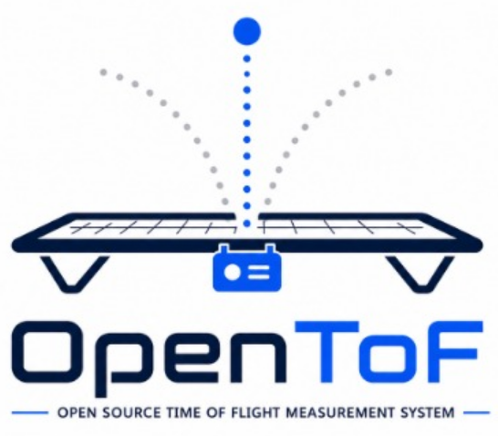

# OpenToF

Open source Time-of-Flight measurement system for Trampolining.

- [`app/`](app/) — the Flutter companion app (Android 10+ / iOS 15+): live jump flight time, a 10-jump
  routine with CSV export, and a chart of recent jumps. See [`app/README.md`](app/README.md).
- [`firmware/`](firmware/) — the Arduino sensor firmware (Seeed XIAO MG24 Sense) and preliminary
  test/reference sketches.
- [`software/`](software/) — standalone Python tools for dumping and plotting raw sensor data.
- [`docs/DECISIONS.md`](docs/DECISIONS.md) / [`docs/PLAN.md`](docs/PLAN.md) — resolved decisions and the
  architecture/milestone plan for the app and firmware together.
- [`docs/hardware/`](docs/hardware/) — hardware datasheets (battery, IMU, board schematic).
